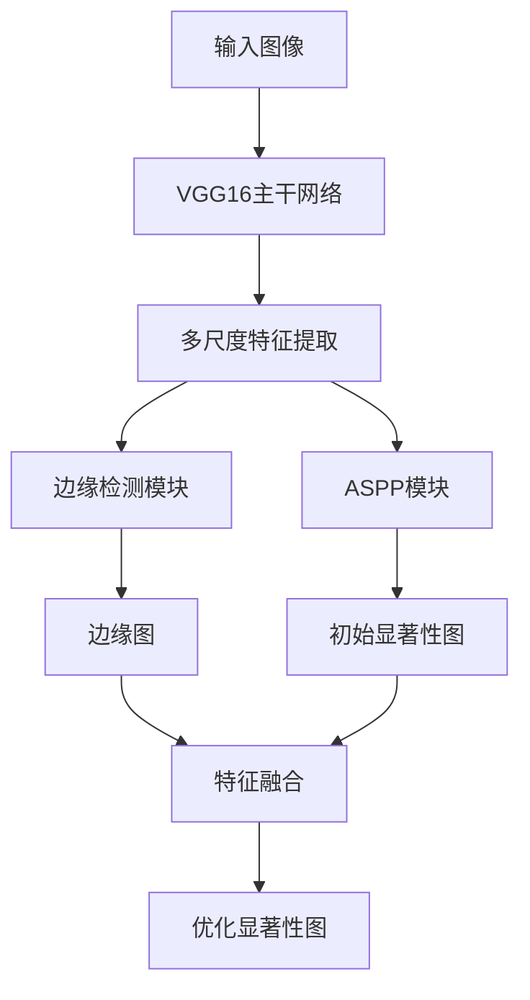

# Scribble_Saliency 项目文档结构

## 1. 项目概述
基于涂鸦标注的弱监督显著性目标检测(CVPR2020)
- 核心创新：使用涂鸦标注代替全监督标注
- 多任务学习框架：同时预测显著性图和边缘图
- 网络架构：基于VGG16的双分支结构

## 2. 目录结构
```
Scribble_Saliency-master/
├── data.py                # 数据加载和处理
├── train.py               # 训练脚本
├── test.py                # 测试脚本
├── utils.py               # 辅助函数
├── model/                 # 模型定义
│   ├── vgg.py             # VGG基础网络
│   ├── vgg_models.py      # 核心网络结构
│   └── __init__.py
├── smoothness/            # 平滑损失
├── data/                  # 数据集
└── results/               # 测试结果
```

## 3. 核心算法实现

### 3.1 网络架构


### 3.2 关键组件
- **Edge_Module**: 多尺度边缘检测
- **ASPP**: 空洞空间金字塔池化
- **特征融合**: 结合低级和高级特征

## 4. 训练流程
1. 数据准备：
   - 涂鸦标注转换为GT和mask
   - RGB图像转换为灰度图
2. 损失函数：
   - BCELoss for 显著性预测
   - BCELoss for 边缘检测
3. 优化器：Adam(lr=1e-4)
4. 学习率衰减策略

## 5. 测试流程
1. 输入：标准测试集(ECSSD/DUT等)
2. 预处理：Resize到352x352
3. 后处理：双线性插值恢复原尺寸
4. 输出：归一化显著性图(0-255)

## 6. 关键代码解析

### 6.1 网络前向传播
```python
def forward(self, x):
    # VGG特征提取
    x1 = self.vgg.conv1(x)  # 64
    x2 = self.vgg.conv2(x1) # 128 
    x3 = self.vgg.conv3(x2) # 256
    x4 = self.vgg.conv4(x3) # 512
    x5 = self.vgg.conv5(x4) # 512
    
    # 边缘检测
    edge_map = self.edge_layer(x1, x3, x4)
    
    # ASPP多尺度特征
    x5 = self.aspp(x5, edge_map)
    
    # 特征融合
    feat_fuse = torch.cat([x_conv5_up, x_conv2], 1)
    
    # 三阶段输出
    return sal_init, edge_map, sal_ref
```

### 6.2 数据加载
- 支持5种输入：RGB图像、GT、mask、灰度图、边缘图
- 统一resize到352x352
- ImageNet标准归一化

## 7. 数据格式要求
- 图像：JPG/PNG格式
- 标注：PNG格式(0:背景, 1:前景, 2:未知)
- 目录结构：
  ```
  data/
    ├── img/       # RGB图像
    ├── gt/        # 标注
    ├── mask/      # mask
    ├── gray/      # 灰度图  
    └── edge/      # 边缘图
