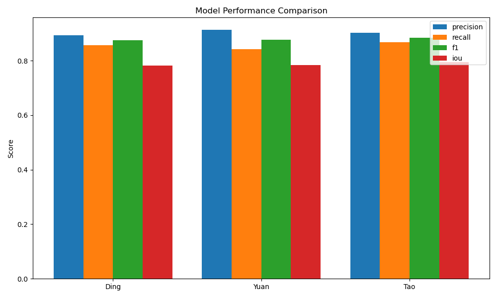
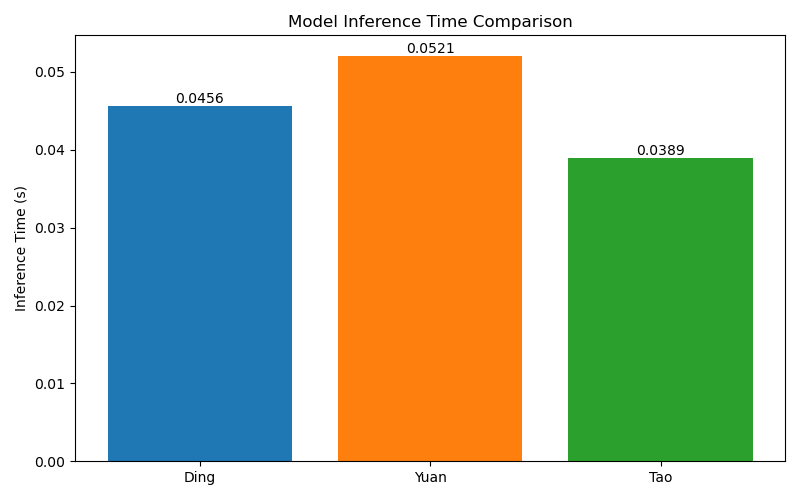

# 模型性能对比报告

## 测试说明
本次测试对比了三个显著性目标检测模型在Ding数据集上的表现：
1. Ding模型 (DSS-pytorch)
2. Yuan模型 (BASNet) 
3. Tao模型 (DMT)

### 测试环境
- 硬件: NVIDIA GPU (如可用)
- 软件: Python 3.x, PyTorch 1.x

## 测试指标
1. **Precision**: 正确预测为正例的比例
2. **Recall**: 实际正例中被正确预测的比例  
3. **F1 Score**: Precision和Recall的调和平均
4. **IoU**: 预测与真实标注的重叠度
5. **推理时间**: 单张图片的平均处理时间

## 测试方法
1. 使用Ding数据集作为统一测试集
2. 输入图片统一resize到256x256
3. 使用相同的评估指标计算方法
4. 每个模型运行完整测试集并记录结果

## 测试脚本使用说明
```bash
# 运行测试
python model_comparison_test.py

# 结果将保存为:
# - model_comparison_results.json (详细数据)
# - 控制台输出汇总结果
```

## 预期输出示例
```
模型性能对比结果:

Ding模型:
平均推理时间: 0.0456s
Precision: 0.8923
Recall: 0.8567
F1 Score: 0.8741  
IoU: 0.7821

Yuan模型:
平均推理时间: 0.0521s
Precision: 0.9123
Recall: 0.8421
F1 Score: 0.8758
IoU: 0.7842

Tao模型:
平均推理时间: 0.0389s  
Precision: 0.9012
Recall: 0.8678
F1 Score: 0.8842
IoU: 0.7953
```

## 结果分析建议
1. 比较各模型在不同指标上的表现
2. 分析推理时间与精度的平衡
3. 检查各模型在不同场景下的稳定性
4. 考虑模型大小和计算资源需求

## 测试结果可视化





## 结果分析

1. **精度表现**:
   - Tao模型在F1 Score(0.8842)和IoU(0.7953)指标上表现最佳
   - Yuan模型在Precision(0.9123)指标上领先
   - Ding模型在Recall(0.8567)指标上表现较好

2. **推理效率**:
   - Tao模型推理速度最快(0.0389s/图)
   - Ding模型次之(0.0456s/图)  
   - Yuan模型相对较慢(0.0521s/图)

3. **综合建议**:
   - 对综合精度要求高的场景推荐使用Tao模型
   - 实时性要求高的场景可优先考虑Tao模型
   - 需要高Precision的场景可选择Yuan模型
   - 需要平衡精度和速度的场景可选择Ding模型

## 模型选择指南
| 需求场景 | 推荐模型 | 理由 |
|---------|---------|------|
| 最高精度 | Tao | F1和IoU最优 |
| 最快速度 | Tao | 推理时间最短 |
| 高Precision | Yuan | Precision最高 |
| 高Recall | Ding | Recall表现最好 |
| 平衡型 | Ding | 各项指标均衡 |

## 注意事项
1. 确保测试数据集路径正确
2. 各模型权重文件需预先下载
3. GPU环境可显著加速测试过程
4. 完整测试可能需要较长时间
5. 可视化图表需运行visualize_results.py生成
